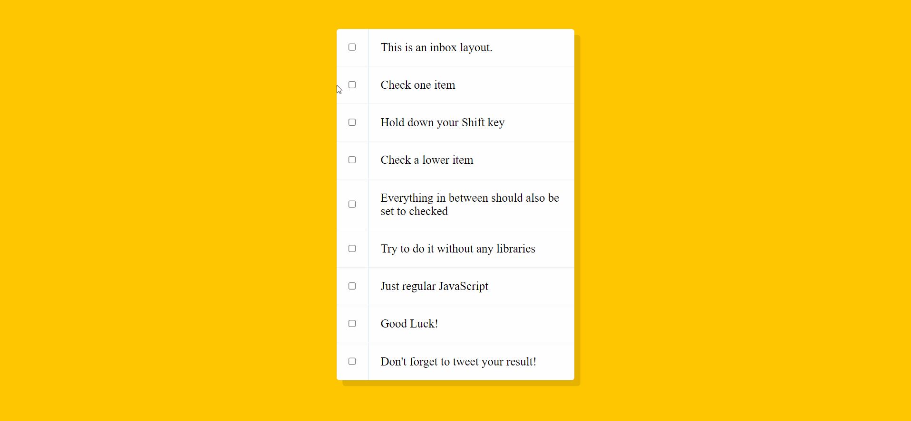

# 30-days-of-javascript

Hi, this repository is dedicated to the 30 days - 30 projects course of [Wes Bos](https://javascript30.com/).

I will doing one by one, trying to do one per day.

## **If you can´t see a JS file, then, it is inside the HTML.**

# Day 1: Drum kit

## 

# Day 2: Clock

## 

# Day 3: Update CSS variables with JS

## 

# Day 4: Array Cardio

This challenge don't have any visuals components, only console

--

# Day 5: Flex Panels Gallery

## 

# Day 6: Ajax Type Ahead

## 

# Day 7: Array Cardio 2

## 

# Day 8: Playing with HTML Canvas

## 

# Day 9: Dev Tools Tricks (console methods)

# Day 10: Hold Shift to Check Checkboxes

# Day 11: Custom HTML 5 Videoplayer

# Day 12: Key Secuence Detection

*[See on glitch](https://mint-factual-city.glitch.me)*

# Day 13: Slide in on Scroll
